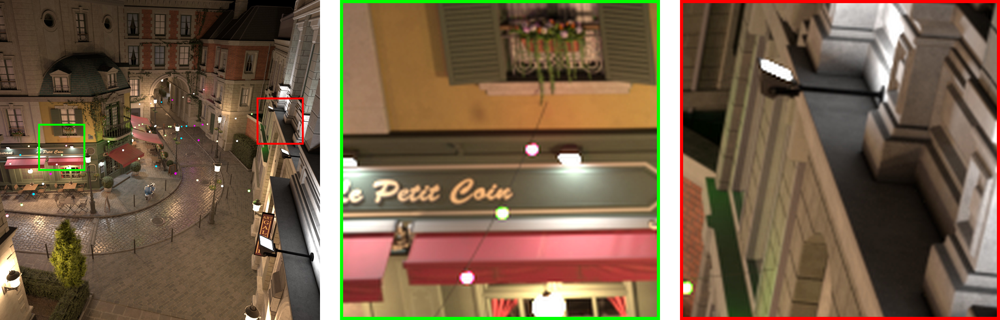
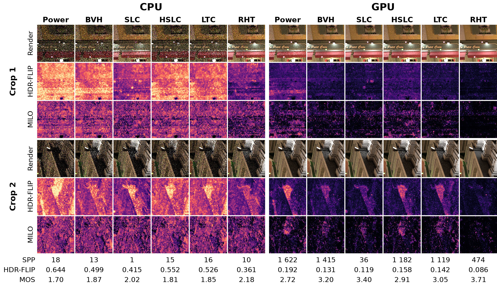
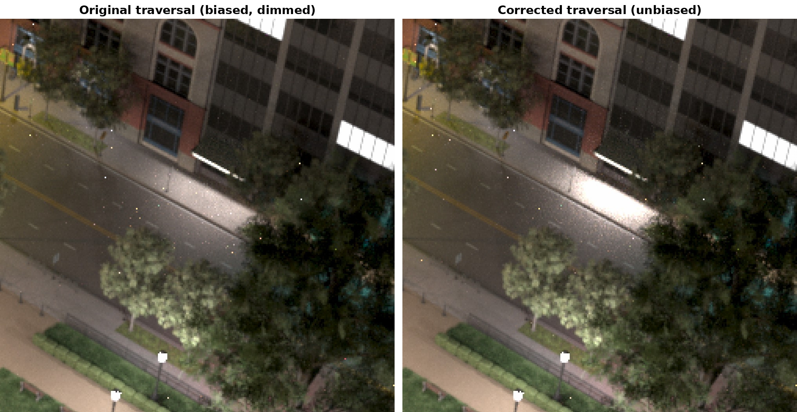

<h1 align="center">Many-Lights Sampling with Tree Hierarchies in pbrt-v4</h1>

<p align="center">
  
</p>
<p align="center"><em>Amazon Lumberyard Bistro, exterior lighting configuration (<b>Bistro 1</b>): 3.9 million triangles illuminated by 20 478 light sources. Left: the reference render with the two 150 × 150 pixel regions used in the visual comparisons (green frame: crop 1, red frame: crop 2). Middle and right: the two reference crops.</em></p>

<p align="center">
  
</p>
<p align="center"><em>Equal-time comparison of all algorithms on <b>Bistro 1</b> after 30 seconds of rendering on the CPU (left) and the GPU (right): rendered crops, HDR-FLIP error maps, and MILO visibility maps (brighter is worse) for both crops, with the samples per pixel, the full-image HDR-FLIP error (lower is better), and the MILO mean opinion score (higher is better) reached at this render time. RHT has the lowest error and the highest score on both targets.</em></p>

This repository is a fork of [pbrt-v4](https://github.com/mmp/pbrt-v4), the renderer of *Physically Based Rendering: From Theory to Implementation*, and is the code accompanying the paper

> **Algorithms for Global Illumination for Scenes with Many Lights Using Tree Hierarchies**<br>
> Richard Kvasnica and Vlastimil Havran, Czech Technical University in Prague<br>
> Submitted to *Computer Graphics Forum*, 2026

The work originates from the master's thesis [dp-kvasnica](https://github.com/tuurvig/dp-kvasnica). It extends pbrt-v4 with three modern, unbiased algorithms for sampling scenes with many lights, Stochastic Lightcuts (SLC), Learning To Cluster (LTC), and the Resampled Hierarchical Tree (RHT), all running on both the CPU and the GPU (CUDA/OptiX wavefront path tracer), together with a GPU H-PLOC builder for light hierarchies and the measurement tooling used in the paper.

## Contents

- [The many-lights problem](#the-many-lights-problem)
- [What the paper does](#what-the-paper-does)
- [Implemented light samplers](#implemented-light-samplers)
- [The Resampled Tree correction](#the-resampled-tree-correction)
- [Hierarchy construction and framework changes](#hierarchy-construction-and-framework-changes)
- [Evaluation](#evaluation)
- [Using the light samplers](#using-the-light-samplers)
- [Building](#building)
- [Citation](#citation)
- [Acknowledgements and license](#acknowledgements-and-license)

## The many-lights problem

Direct illumination at a shading point is the sum of the contributions of every emitter in the scene. Looping over all of them is fine for a few tens of lights, becomes a bottleneck for thousands, and is intractable for millions, mostly because every term needs a visibility test (a shadow ray). Path tracers therefore estimate the sum stochastically from a handful of sampled lights.

The quality of that estimate depends entirely on how the lights are chosen. Sampling proportionally to radiant power keeps picking bright but distant or fully occluded emitters, wasting the budget on samples that contribute nothing while the nearby lights that actually illuminate the point are rarely selected. Light hierarchies fix this: emitters are clustered into a tree by spatial and directional proximity, and the tree is traversed stochastically per shading point with importance weights derived from conservative bounds on the cluster contribution. The cost per sample becomes logarithmic in the number of lights, and the selection adapts to the shading point.

## What the paper does

- **Implements three modern hierarchical light samplers in pbrt-v4**: Stochastic Lightcuts (Yuksel 2020), Learning To Cluster (Wang et al. 2021), and the Resampled Hierarchical Tree (Conty Estevez et al. 2024). All of them run on the CPU and, through pbrt's wavefront integrator, on the GPU. LTC was originally CPU-only and was adapted for wavefront execution.
- **Adds a GPU light-hierarchy builder** based on H-PLOC (Benthin et al. 2024) with extended Morton codes that combine 3D position with a 2D parametrization of the emission cones.
- **Identifies and corrects a flaw in the published Resampled Tree traversal**. The pseudo-code of the original paper accumulates traversal probabilities incorrectly when a node is stochastically split, which produces biased, dimmed images. The corrected traversal is strictly unbiased (see [below](#the-resampled-tree-correction)).
- **Evaluates all methods against the naive power sampler and pbrt's BVH Lights** on eleven scene configurations with up to 1.2 million emitters, using numerical (RMSE, MRSE) and perceptual (HDR-FLIP, MILO) metrics, equal-time comparisons, and per-light visibility statistics.
- **Finds the corrected Resampled Tree to be the most robust method**: fastest CPU hierarchy construction, best prioritization of unoccluded lights, and the highest perceived image quality overall.

## Implemented light samplers

The sampler is selected by the `lightsampler` parameter of the integrator (see [usage](#using-the-light-samplers)).

| Name | Algorithm | Origin | Notes |
|---|---|---|---|
| `power` | Power-proportional sampling | pbrt-v4 | Naive baseline, cheapest per sample. |
| `bvh` | BVH Lights: importance sampling with adaptive tree splitting | [Conty Estevez and Kulla 2018](https://doi.org/10.1145/3233305), pbrt-v4 | Reference hierarchical method; SAOH-built light BVH. |
| `slc` | Stochastic Lightcuts | [Yuksel 2020](https://doi.org/10.1109/TVCG.2020.3001271) | Builds a cut per shading point and traces one shadow ray per cut node. Most expensive per sample. |
| `hslc` | Hierarchical Stochastic Lightcuts | this work | Root-to-leaf traversal with the SLC importance weights, without constructing a cut. Isolates the effect of the weights. |
| `ltc` | Learning To Cluster | [Wang et al. 2021](https://doi.org/10.1145/3478513.3480561) | Online method: a 5D partition tree of shading points caches local cuts that are refined from visibility feedback during rendering. |
| `rht` | Resampled Hierarchical Tree | [Conty Estevez, Hellmuth, and Lecocq 2024](https://doi.org/10.1145/3641233.3664352) | Stochastic tree splitting plus two-stage weighted reservoir resampling. Uses the corrected traversal. |
| `lightcuts` | Classic Lightcuts | Walter et al. 2005 | Requires discretized area lights (`--discretize-area-lights`); falls back to `slc` otherwise. |
| `uniform`, `exhaustive` | Uniform selection, evaluate all lights | pbrt-v4 | Debugging and tiny scenes. |

## The Resampled Tree correction

<p align="center">
  
</p>
<p align="center"><em>Crop of the Emerald Square scene. Left: the traversal implemented exactly as in the original pseudo-code loses energy under stochastically split nodes. Right: the corrected traversal.</em></p>

The Resampled Tree gathers light candidates by descending the hierarchy and, with a distance-dependent probability $P_s(C)$, splitting a node to visit both children instead of stochastically picking one. Every candidate is later weighted by the marginal probability $P_T(L)$ of the traversal reaching its leaf. In the original pseudo-code, a split sets the child-selection probabilities to one, so they never enter the accumulated probability. That overestimates the reaching probability of every leaf below a split node, and dividing by the inflated density dims their contribution.

The correct probability has to combine, at every node, the child-selection probability with the probability that the descent was caused by a split of the parent rather than by stochastic selection. With $P_{ns}(C) = \bigl(P_s(C^\uparrow) - P_s(C)\bigr) / \bigl(1 - P_s(C)\bigr)$ the state accumulated along the path is

$$
T_C = \begin{cases}
1 & C = \text{root} \\
P_{ns}(C) + \bigl(1 - P_{ns}(C)\bigr)\, P_i(C \mid C^\uparrow)\, T_{C^\uparrow} & \text{otherwise}
\end{cases}
$$

and, since a leaf is never split, $T_L$ equals the marginal probability $P_T(L)$. The implementation lives in [src/pbrt/lightsamplers/rht.cpp](src/pbrt/lightsamplers/rht.cpp); the paper's supplementary material quantifies the bias of the original formulation on every test scene.

## Hierarchy construction and framework changes

- **Generalized tree builders.** The CPU builder generalizes pbrt's top-down SAOH construction so that each sampler can use its own node payload and bounding volumes (RHT, for example, keeps only spherical bounds in inner nodes and orientation bounds at the leaves). On the GPU, an H-PLOC builder constructs the hierarchy from 64-bit extended Morton codes and the tree is then flattened into the linear depth-first layout shared by all samplers. The GPU builder is used automatically for `--gpu` renders of scenes with at least 100 lights.
- **Multiple light samples per shading point.** The unshadowed contribution evaluation moved from the integrators into the light samplers, which may now return several samples. This is what SLC's cut evaluation and RHT's resampling stage need.
- **Conservative BRDF bounds.** Several BxDF models were extended to provide the conservative error bounds used by the Lightcuts family, and the wavefront integrator gained material-specific queues so that these bounds can be evaluated without excessive divergence.
- **Random-number hygiene.** Deep traversals exhaust the 24-bit significand of a single random variable and cause structural bias. Fresh bits are injected at every internal node through deterministic spatial hashing and a Cranley-Patterson rotation. RHT's reservoirs are stateless and driven by externally supplied low-discrepancy sequences.
- **Measurement tooling.** Fixed render-time budgets, per-light statistics (selection counts, visible samples, unoccluded contribution), and discretization of area lights into cosine-weighted spotlights.

## Evaluation

All measurements in the paper were made on an AMD Ryzen 7 3700X with 32 GB RAM and an NVIDIA GeForce RTX 4080 with 16 GB VRAM, rendering HDR OpenEXR images on both the CPU and the GPU at fixed render times of up to 600 seconds. Six publicly available scenes were prepared in eleven lighting configurations. The scene files and the measured data are not part of this repository.

| Configuration | Triangles | Lights | Lighting | Source |
|---|---:|---:|---|---|
| Bistro 1 | 3 883 309 | 20 478 | Exterior lights | [Amazon Lumberyard Bistro](https://developer.nvidia.com/orca/amazon-lumberyard-bistro) |
| Bistro 2 | 3 921 575 | 58 744 | Interior lights | [Amazon Lumberyard Bistro](https://developer.nvidia.com/orca/amazon-lumberyard-bistro) |
| Emerald Square 1 | 10 062 116 | 15 711 | Recolored, brighter street lamps | [NVIDIA Emerald Square](https://developer.nvidia.com/orca/nvidia-emerald-square) |
| Emerald Square 2 | 10 117 898 | 71 493 | All scene lights | [NVIDIA Emerald Square](https://developer.nvidia.com/orca/nvidia-emerald-square) |
| Modern Hall 1 | 31 046 | 106 496 | Area lights discretized into spotlights | [Benedikt Bitterli's resources](https://benedikt-bitterli.me/resources/) |
| Modern Hall 2 | 31 482 | 172 032 | As above, colored stairs | [Benedikt Bitterli's resources](https://benedikt-bitterli.me/resources/) |
| Rungholt 1 | 5 959 854 | 58 880 | Torches along the walls | [McGuire Computer Graphics Archive](https://casual-effects.com/data) |
| Rungholt 2 | 5 845 282 | 38 130 | Windows converted to area lights | [McGuire Computer Graphics Archive](https://casual-effects.com/data) |
| Sponza Candles 1 | 7 210 678 | 1 232 239 | Candles, natural colors | [Intel Sample Library](https://www.intel.com/content/www/us/en/developer/topic-technology/graphics-processing-research/samples.html) |
| Sponza Candles 2 | 7 210 854 | 1 232 415 | RGB candles and ceiling lamps | [Intel Sample Library](https://www.intel.com/content/www/us/en/developer/topic-technology/graphics-processing-research/samples.html) |
| MPII view 11 | 6 495 534 | 973 | Goniometric lights behind closed doors and walls | MPII building model (Havran et al. 2009, [Bacík 2025](http://hdl.handle.net/10467/123739)) |

The montage at the top of this page is the equal-time comparison of Bistro 1 after 30 seconds, taken from the supplementary material of the paper. The supplementary contains the same comparison for every configuration at 30 and 600 seconds on both targets, convergence plots of all four metrics, and per-light visibility histograms; the paper itself compares the HDR-FLIP error maps of all eleven configurations after 30 seconds on the GPU.

Key findings:

- **All implemented hierarchical methods are unbiased** and generally outperform the naive power sampler in variance reduction and convergence, at fixed render time and despite computing fewer samples per pixel.
- **RHT spends its budget best.** It reaches the highest global visibility ratio (visible light samples over all light samples) in 8 of the 11 configurations, and its hierarchy builds 2.5 to 4.4 times faster on the CPU than the SAOH tree shared by BVH Lights, SLC, and LTC. On the GPU, H-PLOC needs at most 8.6 ms even for over a million lights; the subsequent flattening dominates the build.
- **Sample quality costs throughput.** RHT computes roughly 40 to 95 % of the samples per pixel of BVH Lights on the CPU and 5 to 40 % on the GPU, where per-thread stochastic splitting causes warp divergence. SLC is the most expensive method because of its multiple shadow rays per interaction.
- **RHT's weak spot is Modern Hall**, where every area light was discretized into 8192 spotlights. Unbounded splitting descends into these dense clusters and collapses the throughput, so RHT trails the other hierarchical methods there even though it resolves the hardest regions (glossy reflections of the emitters) fastest.
- **LTC learns fast but degrades over long renders**; it ranks second at 30 seconds and falls behind at 600 seconds.

Final ranking by MILO mean opinion score during GPU execution, summed over the eleven configurations (lower is better; a rank of 1 is the best method in a configuration):

| Render time | power | bvh | slc | hslc | ltc | rht |
|---|---:|---:|---:|---:|---:|---:|
| 30 s | 60 | 35 | 34 | 43 | 32 | **27** |
| 600 s | 56 | 33 | 37 | 42 | 43 | **20** |

## Using the light samplers

The sampler is chosen in the scene description as a parameter of the integrator; the `path` and `volpath` integrators on the CPU and the wavefront integrator on the GPU (`--gpu`) all honor it. Algorithm parameters are passed through the generic `lsParam1`, `lsParam2`, and `lsParam3` floats.

```
Integrator "path" "string lightsampler" "rht" "float lsParam1" [0.025]
```

| Sampler | `lsParam1` | `lsParam2` | `lsParam3` | Values used in the paper |
|---|---|---|---|---|
| `slc` | relative traversal threshold μ (default 0.02) | | | 0.02; negligible influence because the cut fills its capacity first |
| `rht` | splitting parameter γ (default 0.1) | | | 0.025 converged best in all scenes but Emerald Square 1 |
| `ltc` | β (default 4) | learning-rate decay ω (default 6/7) | Γ (default 128) | paper defaults; ω = 3/4 performed indistinguishably |

Structural limits are compile-time constants set through CMake cache variables:

| CMake variable | Meaning | Default |
|---|---|---|
| `PBRT_LIGHTCUTS_CUT_SIZE` | Maximum number of clusters in a Lightcuts/SLC cut | 32 |
| `PBRT_LTC_MAX_CUT_SIZE` | Maximum number of clusters in an LTC online cut | 64 |
| `PBRT_RHT_RESERVOIR_SET_H_SIZE` | Number of first-stage reservoirs of RHT | 16 |
| `PBRT_RHT_F_SAMPLES` | Number of final RHT shadow rays per shading point | 2 (the paper and the CMake presets use 1) |

Command-line options added by this fork:

```
--render-time <seconds>          Render for a fixed time budget, ignoring spp.
--write-render-time              Write the elapsed render time to render.time.txt.
--perlightstats                  Record per-light statistics; written next to the output image as <image>-lightstats.csv.
--discretize-area-lights <n>     Discretize every area light into up to n cosine-weighted spotlights.
```

A typical equal-time measurement from the paper looks like this:

```bash
pbrt --gpu --render-time 30 --outfile bistro1-rht.exr bistro1-rht.pbrt
```

## Building

The build follows upstream pbrt-v4. Clone with submodules and configure with CMake:

```bash
git clone --recursive https://github.com/tuurvig/pbrt-v4-many-lights.git
cd pbrt-v4-many-lights
cmake --preset linux-x64-release
cmake --build --preset linux-x64-release
```

[CMakePresets.json](CMakePresets.json) contains release, debug, and CPU-only presets for Linux and Windows; adjust the compiler, CUDA, and `PBRT_OPTIX_PATH` entries to your system, or configure manually as described in the [pbrt-v4 README](https://github.com/mmp/pbrt-v4#building-the-code). A C++17 compiler is required. GPU rendering additionally needs an NVIDIA GPU with CUDA and OptiX; the measurements in the paper were made with CUDA Toolkit 13.2 and OptiX 9.0. Without CUDA the samplers still build and run on the CPU.

## Citation

```bibtex
@unpublished{kvasnica2026manylights,
  author = {Kvasnica, Richard and Havran, Vlastimil},
  title  = {Algorithms for Global Illumination for Scenes with Many Lights Using Tree Hierarchies},
  note   = {Submitted to Computer Graphics Forum},
  year   = {2026}
}
```

## Acknowledgements and license

pbrt-v4 is by Matt Pharr, Wenzel Jakob, and Greg Humphreys and is licensed under the Apache License 2.0, which also applies to this fork (see [LICENSE.txt](LICENSE.txt) and [THIRD_PARTY.md](THIRD_PARTY.md)). The GPU hierarchy builder follows the H-PLOC algorithm of Benthin et al. and existing CUDA and Slang implementations of it. The test scenes are courtesy of Amazon Lumberyard and NVIDIA (ORCA), Benedikt Bitterli, Morgan McGuire, Intel, and the authors of the MPII building model.
